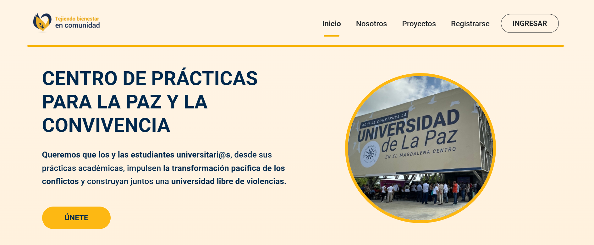

<h1 align="center">Hola, soy Stephania </h1>

  

---

## <picture></picture> Sobre mí

<picture>
  
</picture>

- 🎓 Desarrolladora de Software con enfoque actual en **Frontend**.  
- 🖥️ Trabajo con **HTML, CSS/SCSS, TypeScript, JavaScript, React, Angular, Tailwind y WordPress**.  
- 📊 En formación hacia **Python, análisis de datos e inteligencia artificial**.  
- 💡 Tecnología con **impacto social** y transformación digital responsable.  
- 🚀 Desarrollo **landing pages, sitios web y automatizaciones** para emprendedores y pymes.  
- 📚 Siempre aprendiendo nuevas tecnologías y buenas prácticas.  

 

---

## 🛠️ Mis Habilidades

### <picture></picture> Lenguajes de Programación

 
  
  
  

### <picture></picture> Frontend Development

 
  
  
  
  
  
  

### <picture></picture> Herramientas

  
  
  
  

---

## 🚀 Proyectos Destacados

  
    
  🌐 <a href="https://centro-practicas-frontend-jw4v47wgb-stephania-s-projects.vercel.app" 
         target="_blank" 
         rel="noopener noreferrer">
      Ver demo en Vercel
  </a>

### 📌 Sistema de Gestión Digital - Centro de Prácticas Universitarias
**Universidad de Caldas | Agosto 2024 - Junio 2025 (2 semestres académicos)**

**🔍 Contexto del Proyecto:**  
Proyecto de digitalización desarrollado para resolver procesos manuales ineficientes en el Centro de Prácticas, donde la gestión de documentos se realizaba vía correo electrónico y WhatsApp, centralizándose en una sola persona.

**📊 Proceso de Análisis y Desarrollo:**
- **+10 entrevistas** con diferentes dependencias universitarias para levantamiento de requerimientos
- **Modelado de procesos** con Bizagi y creación de diagramas de flujo personalizados  
- **Coordinación técnica** con webmaster institucional para definición de stack tecnológico
- **Trabajo colaborativo** full-stack (Frontend Angular + Backend .NET)

**⚡ Implementación Frontend:**
- **Arquitectura:** Angular standalone con TypeScript y arquitectura modular escalable
- **Autenticación:** Sistema JWT integrado con API .NET (Este punto backend creación API desarrollado por compañero de equipo)
- **UI/UX:** Implementación responsiva con Bootstrap y SCSS, siguiendo identidad visual institucional
- **Funcionalidades:** Dashboard provisional, formularios reactivos con validaciones, gestión de estados

**🎯 Impacto Esperado:**  
Automatización de procesos de gestión documental que tradicionalmente dependían de métodos manuales, mejorando la eficiencia operativa del Centro de Prácticas.

**🔹 Stack Técnico:** Angular 19 · TypeScript · Bootstrap · SCSS · JWT · Servidor Institucional VPN  
**🔹 Skills Desarrolladas:** Análisis de requerimientos · Entrevistas con usuarios · Modelado de procesos · Desarrollo frontend · Trabajo interdisciplinario

> **Nota:** Este repositorio contiene exclusivamente el frontend. El backend en .NET es institucional y no puede ser publicado por políticas de seguridad universitaria.

---

### 🌸 Landing Page - Curso de Sanación Emocional
**Proyecto Cliente | Freelance**

  

**🎯 Objetivo:** Landing page conversion-optimizada para promocionar curso de sanación emocional, enfocada en conectar emocionalmente con la audiencia y facilitar el proceso de inscripción.

**🚀 Características principales:**
- **Hero emocional** con CTA visible y claro orientado a conversión
- **Metodología estructurada:** Secciones (Conexión → Fortaleza → Compasión → Autopreservación)
- **Temario visual:** 8 sesiones organizadas en tarjetas interactivas
- **Testimonios dinámicos:** Sistema de testimoniales (placeholder para contenido real)
- **Pagos locales:** Integración con Nequi/Daviplata mediante QR modal
- **Mini-agente FAQ:** Implementación de IA para responder preguntas frecuentes

**🛠️ Stack Técnico:** React · Vite · TailwindCSS · Vercel  
**🔹 Skills:** Diseño UX/UI · Optimización de conversión · Integración de APIs · Desarrollo cliente

*Desarrollada inspirándose en mockups de Picto (ThemeWagon) con adaptaciones personalizadas*

---

## <picture></picture> Conecta conmigo

  
  
  

---

## 📊 GitHub Stats

  
  

